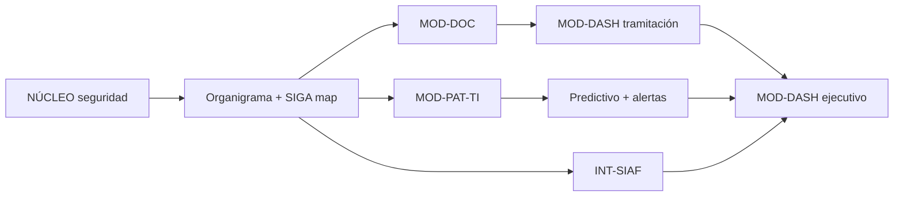

# Alcance y priorización — Fase 1 (MVP)

**Versión:** 1.1  
**Método de priorización:** MoSCoW + dependencias técnicas  
**Prompt origen:** R-003 (priorización de backlog)

---

## Resumen ejecutivo

La Fase 1 entrega un **núcleo transversal de seguridad** y tres módulos operativos alineados a procesos S.01, S.05 (TI) y E.01/E.02, más integraciones de lectura con SIGA y SIAF. El resto del mapa de procesos queda documentado como **referencia y roadmap**.

---

## MoSCoW — Fase 1

### Must have (obligatorio para MVP)

| ID | Entregable | Proceso | Dependencia |
|----|------------|---------|-------------|
| M-01 | Autenticación y sesión segura | NÚCLEO | — |
| M-02 | RBAC por organigrama | NÚCLEO | M-01, organigrama |
| M-03 | Auditoría de operaciones | NÚCLEO | M-01 |
| M-04 | Registro expedientes + numeración por tipo/año | S.01 | M-02 |
| M-05 | Derivación y devolución (gerencia real) | S.01 | M-04 |
| M-06 | Firma digital + sello en documentos | S.01 | M-04 |
| M-07 | Catálogo tipos documentales institucional | S.01 | M-04 |
| M-08 | Trazabilidad e historial | S.01 | M-04, M-05 |
| M-09 | Bandeja de pendientes | S.01 | M-05 |
| M-10 | Inventario Patrimonio + vista parcial UTIS | S.05 | M-02 |
| M-11 | Fichas técnicas y de mantenimiento | S.06 | M-10 |
| M-12 | Incidencias técnicas | S.06 | M-10 |
| M-13 | ML Random Forest + semáforo de riesgo | S.05 / S.06 | M-11, M-12 |
| M-14 | Dashboard tramitación (sin SLA) | E.01 | M-08 |
| M-15 | Dashboard alertas TI + SIAF restringido | E.01 / E.02 | M-13 |
| M-16 | Integración API SIGA + simulador | S.05 / S.02 | M-10 |
| M-17 | Integración SIAF lectura + simulador | S.04 | M-15 |

### Should have (importante, sprint 2 si MVP ajustado)

| ID | Entregable | Proceso |
|----|------------|---------|
| S-01 | Modo oscuro / contraste suave (UX) | Transversal |
| S-02 | Adjuntos digitalizados en expedientes | S.01 |
| S-03 | Exportación reportes PDF/Excel | E.01 |

### Could have (si hay capacidad)

| ID | Entregable | Proceso |
|----|------------|---------|
| C-01 | Notificaciones internas (email/in-app) | S.01 |
| C-02 | Exportación reportes PDF/Excel | E.01 |
| C-03 | Filtros avanzados guardados por usuario | Transversal |

### Won't have (esta fase)

| Elemento | Fase objetivo |
|----------|---------------|
| Módulos M.02 tributación y ventanilla | Fase 3 |
| Módulos M.03 programas sociales | Fase 4 |
| Módulo obras e inversiones M.01 | Fase 2 |
| Patrimonio no informático (maquinarias) | Fase 2 |
| Abastecimiento S.03 | Fase 3 |
| Portal ciudadano | Fuera de ERP interno |

---

## Orden de implementación sugerido

| Sprint | Objetivo | Historias |
|--------|----------|-----------|
| 1 | Fundación | HU-SEC-*, HU-ORG-* |
| 2 | Documentaria core | HU-DOC-01 a HU-DOC-05 |
| 3 | Patrimonial TI | HU-PAT-01 a HU-PAT-04 |
| 4 | Integraciones | HU-INT-*, HU-DASH-01 |
| 5 | Inteligencia y UX | HU-PAT-05, HU-DASH-02, HU-UX-* |

---

## Roadmap por proceso institucional

| Proceso | Fase 1 | Fase 2 | Fase 3+ |
|---------|--------|--------|---------|
| E.01 | Dashboard | Reportes comités | — |
| E.02 | SIAF lectura | PMI | — |
| E.03 | Derivación doc | Dictámenes | — |
| M.01 | Expedientes | Obras | — |
| M.02 | — | — | Tributación |
| M.03 | — | — | Social |
| S.01 | **Completo MVP** | Archivo digital | — |
| S.02 | SIGA map | — | Solicitudes |
| S.03 | — | Requerimientos | Compras |
| S.04 | SIAF lectura | — | — |
| S.05 | TI only | Patrimonio full | Maquinarias |
| S.06 | Incidencias | CMDB | Proyectos |
| C.01 | Auditoría read | — | Reportes OCI |

---

## Criterios de cierre Fase 1

1. Al menos 3 unidades piloto usando tramitación documentaria digital.
2. Inventario TI sincronizado con SIGA (≥90% bienes informáticos).
3. Dashboard visible para Gerencia Municipal con métricas de tramitación.
4. 0 vulnerabilidades críticas en revisión de seguridad.
5. Documentación de requisitos, prompts y ADRs versionada en repositorio.
