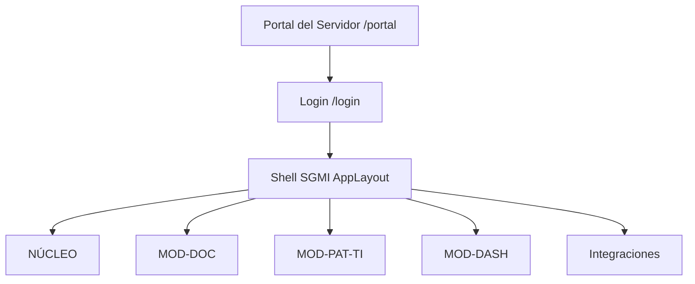

# Arquitectura de interfaz, módulos y acceso por rol

**Versión:** 1.0  
**Fecha:** 2026-06-11  
**Estado:** Confirmado (PA-23, PA-24)  
**Relacionado:** [alcance-y-priorizacion.md](./alcance-y-priorizacion.md), [organigrama-institucional.md](./organigrama-institucional.md), [flujo-documentario-multietapa.md](../02_diseno/flujo-documentario-multietapa.md)

---

## 1. Decisión de arquitectura de producto

El SGMI se implementa como **una sola aplicación web** con **un inicio de sesión**, no como múltiples “ventanas” o portales independientes por gerencia o unidad (Presupuesto, Logística, Patrimonio, UTIS, etc.).

| Enfoque | Decisión Fase 1 |
|---------|-----------------|
| Varias apps / sitios por área | **No** |
| Una app + menú dinámico por rol y permisos | **Sí** |
| Portal del Servidor como hub institucional | **Sí** (`/portal`), separado del SGMI autenticado |
| Bandejas y datos filtrados por unidad activa del usuario | **Sí** |

---

## 2. Capas de la experiencia de usuario



### 2.1 Portal del Servidor (público interno, sin operación documental)

- Enlaces institucionales: Intranet, correo, capacitaciones, directorio.
- Acceso principal al SGMI: **INGRESAR AL SGMI**.
- No sustituye bandejas ni trazabilidad.

### 2.2 SGMI autenticado (`/admin/...`)

- **Shell común:** sidebar, header, footer (`AppLayout`).
- **Módulos** como secciones del menú, visibles según **rol + permisos**.
- **Panel de Control:** vista operativa del usuario/unidad.
- **Dashboard Estratégico:** vista consolidada (gerencia, alta dirección).

---

## 3. Módulos Fase 1

| Módulo | Código | Quién lo usa (típico) | Función |
|--------|--------|------------------------|---------|
| Núcleo | NÚCLEO | UTIS, administradores | Usuarios, roles, organigrama, auditoría |
| Gestión documental | MOD-DOC | Todas las unidades operativas | Expedientes, derivar, devolver, bandeja, trazabilidad, firma |
| Patrimonial TI | MOD-PAT-TI | Patrimonio (dueño), UTIS (parcial) | Inventario IT, fichas, incidencias, ML |
| Dashboard | MOD-DASH | Gerentes, finanzas, alta dirección | Tramitación, alertas TI, SIAF lectura |
| Integraciones | INT | Sistema / UTIS | SIGA, SIAF, simuladores |

Cada área con “más servicios” (Contabilidad, Logística, Presupuesto, Secretaría General, UTIS, Patrimonio) accede a **módulos adicionales en el mismo menú**, no a otra aplicación.

---

## 4. Rol + unidad activa

Modelo de acceso confirmado (PA-03, PA-05):

```
Usuario autenticado
  └── 1 unidad activa (organigrama)
  └── 1 o más roles (permisos)
        └── menú visible + acciones permitidas
        └── bandeja documental = expedientes donde unidad_actual = unidad del usuario
```

| Concepto | Define |
|----------|--------|
| **Unidad activa** | Qué expedientes aparecen en “mi bandeja” por defecto |
| **Rol** | Qué módulos y acciones ve (derivar, registrar, inventario, dashboard SIAF, etc.) |
| **Vista ejecutiva** | Alcaldía / Gerencia Municipal: paneles y consultas, sin operación documental masiva |

---

## 5. Ejemplos por área

| Área / unidad | Menú típico (además de documental si aplica) |
|---------------|-----------------------------------------------|
| Secretaría General / Trámite documentario | MOD-DOC completo, tipos documentales, numeración |
| Presupuesto, Contabilidad, Tesorería | MOD-DOC (bandeja), MOD-DASH SIAF |
| Patrimonio | MOD-DOC, MOD-PAT-TI (registro completo) |
| UTIS | MOD-PAT-TI (vista parcial), incidencias, NÚCLEO usuarios |
| Logística / Abastecimiento / Almacén | MOD-DOC (derivar, devolver, bandeja) |
| Cualquier unidad operativa | MOD-DOC según permiso de operador |
| Gerencia Municipal / Alcaldía | Dashboard estratégico, consultas |

El **flujo documental entre unidades** (Presupuesto → Almacén → …) ocurre dentro del **mismo MOD-DOC**; ver [flujo-documentario-multietapa.md](../02_diseno/flujo-documentario-multietapa.md).

---

## 6. Implementación frontend (estado actual)

| Pantalla | Ruta | Notas |
|----------|------|-------|
| Portal del Servidor | `/portal` | Sin AppLayout |
| Login | `/login` | Sin AppLayout |
| Panel de Control | `/admin/dashboard` | AppLayout |
| Dashboard Estratégico | `/admin/dashboard-estrategico` | AppLayout |
| Bandeja | `/admin/gestion-documental/bandeja` | AppLayout |
| Registro expediente | `/admin/gestion-documental/registro` | AppLayout |
| Trazabilidad | `/admin/gestion-documental/trazabilidad/:id` | AppLayout |

**Próximo paso técnico:** menú generado desde permisos del usuario (`/api/user` → `capabilities` o equivalente).

---

## 7. Lo que no se hace en Fase 1

- Portal separado por gerencia (Contabilidad App, Logística App, etc.).
- Rutas documentales fijas por tipo en configuración.
- Portal ciudadano (fuera de alcance ERP interno).
- Flujo documentario para comités/mesas (PA-04).
