# Catálogo de tipos de normas y documentos legales

**Versión:** 1.0  
**Fecha:** 2026-06-11  
**Estado:** Propuesta para carga inicial (PA-07, PA-29)  
**Módulo:** MOD-DOC (S.01)  
**Administrador del catálogo:** Secretaría General (ORG-019 / ORG-048)  
**Fuente:** Listado institucional municipal — normas y documentos legales

**Relacionado:** [organigrama-institucional.md](./organigrama-institucional.md), [decisiones-confirmadas.md](./decisiones-confirmadas.md), [digitalizacion-tramite-documentario.md](./digitalizacion-tramite-documentario.md), [modelo-datos.md](../02_diseno/modelo-datos.md)

---

## 1. Gestión documental por área y por tipo

En la Municipalidad Provincial de Acobamba **cada área tramita su documentación** según los tipos que emite o gestiona en la práctica. No todo el personal registra todos los tipos: **Alcaldía**, **Concejo** y **Secretaría General** producen o formalizan normas de nivel político-institucional; las **gerencias, sub gerencias y unidades** producen resoluciones y documentos de su competencia.

### 1.1 Cómo lo resuelve el SGMI

| Concepto | Implementación |
|----------|----------------|
| Catálogo único institucional | Tabla `tipos_documentales` administrada por Secretaría General (PA-07) |
| Numeración por tipo y año | Secuencia independiente por tipo (PA-09); ej. `RAL-2026-001` |
| Gestión por área | Cada tipo tiene **unidad emisora** (`unidad_emisora_id`); solo esa unidad (y roles delegados) **registra** expedientes de ese tipo |
| Trámite multietapa | El expediente puede **derivar** a otras unidades aunque el tipo sea de un área; la bandeja sigue por `unidad_actual` |
| Una sola aplicación | Todas las áreas usan el mismo SGMI; el selector de tipo al registrar filtra según la unidad activa del usuario (PA-23) |

### 1.2 Quién puede registrar qué

| Rol / unidad | Tipos que puede registrar al crear expediente |
|--------------|-----------------------------------------------|
| **Secretaría General** (Trámite documentario) | Todos los tipos del catálogo; formalización de actos de **Alcaldía** y **Concejo** cuando el trámite lo exige |
| **Alcaldía** (vista ejecutiva + operadores delegados) | Decretos de Alcaldía, Resoluciones de Alcaldía |
| **Concejo Municipal** (operadores delegados) | Acuerdos, ordenanzas, resoluciones de concejo |
| **Gerencia / Sub gerencia / Unidad** | Tipos cuya `unidad_emisora` es esa unidad o su gerencia padre según regla PA-29 |
| **Otras unidades** | Tipos de **gestión interna** (memorándum, informe, solicitud, etc.) cuando se agreguen al catálogo |

**Validación al registrar:** `unidad_origen` del expediente debe coincidir con la **unidad emisora** del tipo (o unidad hija autorizada). Secretaría General puede registrar en nombre de unidades políticas cuando el tipo lo indica (`registro_por_secretaria = true`).

---

## 2. Clasificación de tipos

| Clase (`clase_norma`) | Descripción | Ejemplos en catálogo |
|-----------------------|-------------|----------------------|
| `acuerdo` | Acuerdos de autoridad colegiada o nivel superior | Acuerdo Municipal, Acuerdo de Concejo |
| `decreto` | Actos del ejecutivo local | Decreto de Alcaldía |
| `ordenanza` | Normas municipales de rango legal | Ordenanza Municipal |
| `resolucion` | Actos de gerencias, sub gerencias, alcaldía, concejo | Resolución Gerencial, Resolución de Alcaldía |
| `directiva` | Disposiciones de aplicación interna | Directiva |

| Ámbito de emisión (`ambito_emision`) | Descripción |
|--------------------------------------|-------------|
| `concejo` | Concejo Municipal |
| `alcaldia` | Alcaldía |
| `gerencia_municipal` | Gerencia Municipal |
| `gerencia` | Gerencia de línea (ORG-016 … ORG-022) |
| `sub_gerencia` | Sub gerencia bajo una gerencia |
| `unidad` | Unidad operativa específica |

---

## 3. Catálogo inicial — normas y documentos legales

Prefijos sugeridos para numeración (Secretaría General puede ajustar al cargar). Código interno SGMI en columna `codigo`.

| # | Nombre institucional | Código SGMI | Prefijo | Clase | Ámbito | Unidad emisora (ORG) | Registro vía Secretaría |
|---|----------------------|-------------|---------|-------|--------|----------------------|-------------------------|
| 1 | Acuerdo Municipal | ACM | ACM | acuerdo | concejo | ORG-001 Concejo Municipal | Sí |
| 2 | Acuerdo Regional | ACR | ACR | acuerdo | concejo | ORG-001 Concejo Municipal | Sí |
| 3 | Acuerdo de Concejo | ADC | ADC | acuerdo | concejo | ORG-001 Concejo Municipal | Sí |
| 4 | Acuerdo de Concejo Municipal | ADCM | ADCM | acuerdo | concejo | ORG-001 Concejo Municipal | Sí |
| 5 | Decreto de Alcaldía | DAL | DAL | decreto | alcaldia | ORG-002 Alcaldía | Sí |
| 6 | Directiva | DIR | DIR | directiva | gerencia_municipal | ORG-003 Gerencia Municipal | Sí |
| 7 | Ordenanza Municipal | OM | OM | ordenanza | concejo | ORG-001 Concejo Municipal | Sí |
| 8 | Resolución | RES | RES | resolucion | gerencia | — (genérico; ver nota) | No |
| 9 | Resolución General de Administración | RGA | RGA | resolucion | gerencia | ORG-022 Gerencia de Administración | No |
| 10 | Resolución Gerencial | RG | RG | resolucion | gerencia | — (plantilla genérica gerencia) | No |
| 11 | Resolución Gerencial General Regional | RGGR | RGGR | resolucion | gerencia_municipal | ORG-003 Gerencia Municipal | Sí |
| 12 | Resolución Gerencial de Desarrollo Económico | RGDES | RGDES | resolucion | sub_gerencia | ORG-038 Sub Gerencia de Desarrollo Económico | No |
| 13 | Resolución Gerencial de Desarrollo Social | RGDSS | RGDSS | resolucion | sub_gerencia | ORG-039 Sub Gerencia de Desarrollo Social | No |
| 14 | Resolución Gerencial de Planeamiento, Presupuesto y Modernización | RGPPM | RGPPM | resolucion | gerencia | ORG-021 Gerencia de Planeamiento y Presupuesto | No |
| 15 | Resolución Gerencial de Recursos Naturales y Medio Ambiente | RGRNMA | RGRNMA | resolucion | unidad | ORG-046 Unidad de Gestión Ambiental | No |
| 16 | Resolución Sub Gerencial | RSG | RSG | resolucion | sub_gerencia | — (según sub gerencia) | No |
| 17 | Resolución de Alcaldía | RAL | RAL | resolucion | alcaldia | ORG-002 Alcaldía | Sí |
| 18 | Resolución de Concejo | RC | RC | resolucion | concejo | ORG-001 Concejo Municipal | Sí |
| 19 | Resolución de Concejo Municipal | RCM | RCM | resolucion | concejo | ORG-001 Concejo Municipal | Sí |
| 20 | Resolución de Consejo Municipal | RCONM | RCONM | resolucion | concejo | ORG-001 Concejo Municipal | Sí |
| 21 | Resolución de Gerencia | RGGEN | RGGEN | resolucion | gerencia | — (cualquier gerencia de línea) | No |
| 22 | Resolución de Gerencia Municipal | RGM | RGM | resolucion | gerencia_municipal | ORG-003 Gerencia Municipal | Sí |
| 23 | Resolución de Gerencia de Administración | RGADM | RGADM | resolucion | gerencia | ORG-022 Gerencia de Administración | No |
| 24 | Resolución de Gerencia de Gestión Ambiental y Servicios | RGGAS | RGGAS | resolucion | gerencia | ORG-018 Gerencia Desarrollo Social, Económico y Gestión Ambiental | No |
| 25 | Resolución de Gerencial Regional | RGR | RGR | resolucion | gerencia_municipal | ORG-003 Gerencia Municipal | Sí |

### Notas del catálogo

1. **Tipos genéricos** (`RES`, `RG`, `RGGEN`, `RSG`): en operación diaria el operador debe elegir el **subtipo específico** cuando exista en catálogo (ej. preferir `RGDES` antes que `RG`). Los genéricos quedan para casos no listados hasta que Secretaría General cree el tipo específico.
2. **Nombres duplicados o similares** (Resolución de Concejo / Concejo Municipal / Consejo Municipal): se mantienen como tipos distintos si así figuran en el listado institucional; Secretaría General puede **fusionar** códigos tras validación legal si son equivalentes.
3. **Acuerdo Regional**: documento de referencia o coordinación regional; trámite interno en Concejo con posible derivación a gerencias.
4. **Directiva**: suele emitirse a nivel Gerencia Municipal o gerencia de línea; valor por defecto ORG-003; ajustable por Secretaría General.
5. **Otros gerencias** (Desarrollo Urbano, Servicios Públicos, Asesoría Legal): se agregarán tipos específicos con el mismo patrón (`codigo`, `unidad_emisora_id`) cuando el listado institucional los incluya.

---

## 4. Flujo por área (ejemplo)

```mermaid
flowchart TB
    subgraph concejo [Concejo / Secretaría]
        T1[Ordenanza / Acuerdo / Resolución de Concejo]
        SG[Secretaría General registra y numera]
        T1 --> SG
    end

    subgraph alcaldia [Alcaldía / Secretaría]
        T2[Decreto / Resolución de Alcaldía]
        SG2[Secretaría formaliza]
        T2 --> SG2
    end

    subgraph gpp [Gerencia Planeamiento y Presupuesto]
        T3[Resolución RGPPM]
        OP3[Operador GPP registra]
        T3 --> OP3
        OP3 -->|derivar| OTRAS[Presupuesto, Tesorería, …]
    end

    subgraph gdsea [Sub Gerencia Desarrollo Económico]
        T4[Resolución RGDES]
        OP4[Operador sub gerencia]
        T4 --> OP4
    end
```

Cada área ve en **bandeja** los expedientes cuya `unidad_actual` es su unidad, independientemente del tipo. Al **registrar**, solo ve los tipos asignados a su unidad emisora.

---

## 5. Reglas de negocio (PA-29)

1. Secretaría General **administra** el catálogo (crear, editar prefijos, activar/inactivar) — HU-DOC-07.
2. Al **registrar expediente**, el selector de tipo muestra solo tipos donde:
   - `unidad_emisora_id` = unidad activa del usuario, **o**
   - unidad activa es hija de la unidad emisora (sub unidad bajo la gerencia), **o**
   - `registro_por_secretaria = true` y el usuario tiene rol `SECRETARIA_GENERAL`.
3. `unidad_origen` del expediente se asigna automáticamente a la **unidad emisora** del tipo (o unidad activa si coincide).
4. Numeración: `prefijo-año-secuencial` por tipo (PA-09).
5. Firma y sello obligatorios (PA-08); derivación libre entre unidades (PA-26) sin cambiar el tipo del expediente.
6. Tipos **inactivos** no aparecen en el selector (HU-DOC-07).

---

## 6. Extensión del modelo de datos

Campos adicionales en `tipos_documentales` (ver [modelo-datos.md](../02_diseno/modelo-datos.md) y `schema-inicial.sql`):

| Columna | Uso |
|---------|-----|
| `clase_norma` | ENUM: acuerdo, decreto, ordenanza, resolucion, directiva, otro |
| `ambito_emision` | ENUM: concejo, alcaldia, gerencia_municipal, gerencia, sub_gerencia, unidad |
| `unidad_emisora_id` | FK a `unidades_organizacionales`; unidad que gestiona el tipo |
| `registro_por_secretaria` | BOOLEAN; Secretaría General puede registrar en nombre de la unidad emisora |

---

## 7. Carga inicial y mantenimiento

| Paso | Responsable | Acción |
|------|-------------|--------|
| 1 | Secretaría General | Validar listado legal con Asesoría Legal |
| 2 | UTIS / desarrollo | Seed o import CSV desde esta tabla (sección 3) |
| 3 | Secretaría General | Ajustar prefijos y formatos de numeración |
| 4 | Cada gerencia | Verificar que sus operadores ven solo sus tipos al registrar |
| 5 | Continuo | Nuevos tipos institucionales → alta en catálogo antes de uso |

---

## 8. Trazabilidad

| Elemento | RF / HU / PA |
|----------|--------------|
| Catálogo institucional | RF-DOC-11, HU-DOC-07, PA-07 |
| Numeración por tipo/año | RF-DOC-01, PA-09 |
| Gestión por área | PA-29 |
| Expediente multietapa | PA-24, RF-DOC-03–06 |
| Firma y sello | PA-08, HU-DOC-08 |
