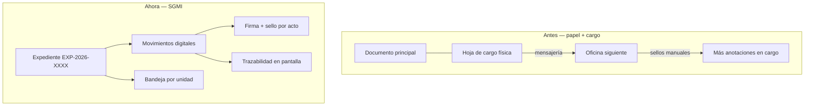

# Digitalización del trámite documentario — Del cargo físico al SGMI

**Versión:** 1.0  
**Fecha:** 2026-06-11  
**Estado:** Confirmado (PA-28)  
**Módulo:** MOD-DOC (S.01)  
**Audiencia:** stakeholders, Secretaría General, gerencias operativas, equipo de desarrollo

**Relacionado:** [ficha-proyecto.md](./ficha-proyecto.md), [decisiones-confirmadas.md](./decisiones-confirmadas.md), [flujo-documentario-multietapa.md](../02_diseno/flujo-documentario-multietapa.md), [ADR-004](../02_diseno/adr/ADR-004-firma-digital-sello.md)

---

## 1. Situación anterior (tramitación en papel)

En la práctica habitual de la Municipalidad Provincial de Acobamba, un expediente administrativo **no circula solo con el documento principal** (memorándum, solicitud, informe, etc.). Para **hacer seguimiento** y dejar constancia de que cada oficina recibió, tramitó o remitió el trámite, se usa además un **cargo documental** (hoja de cargo, acuse de recibo o constancia de derivación en papel).

### 1.1 Qué cumple el cargo en el mundo físico

| Función del cargo en papel | Qué registra |
|----------------------------|--------------|
| **Acuse de recibo** | Que la unidad X recibió el expediente en fecha y hora |
| **Constancia de salida** | Que la unidad X remitió el trámite a la unidad Y |
| **Seguimiento** | Permite a cualquier servidor preguntar “¿dónde está el expediente?” |
| **Responsabilidad** | Firma o sello de quien recibe o quien deriva |
| **Historial** | Hoja adjunta con varios sellos al pasar por Presupuesto → Almacén → Administración → … |

### 1.2 Limitaciones del modelo con cargo físico

| Limitación | Impacto en la operación |
|------------|-------------------------|
| **Traslado físico** | El expediente y el cargo deben moverse entre oficinas; demoras por mensajería interna |
| **Seguimiento manual** | Para saber el estado hay que llamar, revisar papel o buscar en archivos |
| **Cargo separado del contenido** | El documento útil y la constancia de trámite pueden desincronizarse o extraviarse |
| **Sellos y firmas repetidos** | Cada área firma/sella en papel; reproceso si falta un sello |
| **Sin visión consolidada** | Gerencia y Secretaría General no tienen un panel único de pendientes por unidad |
| **Auditoría costosa** | Reconstruir la cadena exige revisar físicamente hojas de cargo y sellos |
| **Duplicidad de esfuerzo** | Mismo trámite anotado en cuadernos, carpetas y hojas de cargo distintas |

Estas limitaciones motivan el **SGMI**: centralizar el trámite en una plataforma digital con trazabilidad automática, sin depender de una hoja de cargo física para el seguimiento.

---

## 2. Cómo el SGMI optimiza el flujo (modelo digital)

El SGMI **no elimina** la lógica institucional del cargo (recibir, tramitar, remitir, dejar constancia). **La incorpora al expediente electrónico**: cada movimiento entre unidades queda registrado, firmado y sellado en el sistema. **No se requiere una entidad “Cargo” aparte** ni una hoja física adicional para hacer seguimiento.

### 2.1 Principio central

> **Un expediente digital (`EXP-{año}-{secuencia}`) + historial de movimientos firmados = sustituto funcional del cargo físico para seguimiento y constancia.**

El servidor consulta **código de expediente**, **bandeja de pendientes** o **trazabilidad** en lugar de pedir “el cargo del documento”.

### 2.2 Equivalencia cargo físico ↔ SGMI

| Práctica en papel | Equivalente en SGMI | RF / HU |
|-------------------|---------------------|---------|
| Hoja de cargo adjunta | Historial de `expediente_movimientos` ligado al expediente | RF-DOC-06, HU-DOC-03 |
| “¿Dónde está?” | Campo `unidad_actual` + línea de tiempo | RF-DOC-06, RF-DOC-10 |
| Bandeja de la oficina | Bandeja filtrada por unidad del usuario | RF-DOC-07, HU-DOC-04 |
| Derivación a otra gerencia | Acción **Derivar** con destino libre | RF-DOC-03, PA-26 |
| Devolución con observación | **Devolver** automático al remitente inmediato | RF-DOC-05, PA-27 |
| Sello al recibir en oficina | Firma + sello en **recepción / acuse digital** | RF-DOC-12/13, PA-28 |
| Sello al remitir | Firma + sello al **proveer / derivar** | RF-DOC-12/13, ADR-004 |
| Firma en cada área | Registro en `documento_firmas` por movimiento y unidad | HU-DOC-08 |
| PDF con varios sellos | PDF versionado con sellos acumulados | ADR-004 |
| Consulta gerencial | Dashboard y búsqueda en tiempo real | RF-DOC-10, MOD-DASH |

### 2.3 Flujo digital resumido

---

## 3. Firma y sello en cada área (sin cargo en papel)

La municipalidad suele **firmar y sellar** en cada oficina que recepciona o tramita. En SGMI esto se modela así:

| Momento institucional | Acción en sistema | Constancia digital |
|-----------------------|-------------------|-------------------|
| Unidad **recibe** el expediente en su bandeja | Recepcionar / acuse digital | Firma + sello “RECIBIDO” (unidad, usuario, fecha) |
| Unidad **tramita y remite** | Firmar y sellar + **Derivar** | Proveído + firma/sello de salida |
| Unidad **devuelve** | **Devolver** con observación obligatoria | Registro de devolución (+ sello opcional) |
| Documento **final** (resolución, informe) | Firma sobre el PDF del documento | HU-DOC-08, ADR-004 |

**Reglas (PA-28):**

1. El expediente en bandeja puede estar **pendiente de recepción** hasta que un usuario autorizado **recepciona con firma y sello**.
2. Solo tras recepcionar (cuando aplique) puede **derivar** o **devolver** desde esa unidad.
3. Cada recepción, derivación o devolución deja en historial: unidad, usuario, fecha, identificador de firma y sello aplicado.
4. La pantalla de **trazabilidad** muestra la cadena completa (equivalente a la hoja de cargo con varios sellos).

Detalle técnico: [ADR-004](../02_diseno/adr/ADR-004-firma-digital-sello.md), [flujo-documentario-multietapa.md](../02_diseno/flujo-documentario-multietapa.md).

---

## 4. Beneficios de la optimización

| Área | Beneficio |
|------|-----------|
| **Operación diaria** | Bandeja digital por unidad; menos traslado físico solo para “llevar el cargo” |
| **Seguimiento** | Estado consultable por código en segundos (RF-DOC-10) |
| **Responsabilidad** | Usuario, unidad y timestamp en cada movimiento (RF-NC-05) |
| **Secretaría General** | Numeración por tipo y año; historial único por expediente |
| **Gerencia / Alcaldía** | Vista ejecutiva de pendientes y tiempos sin operar bandejas (PA-06) |
| **OCI / auditoría** | Log inalterable; reconstrucción de cadena sin buscar papel |
| **Calidad del trámite** | Devolución con observación obligatoria y retorno automático (PA-27) |

### 4.1 Lo que el SGMI no pretende en Fase 1

| Tema | Alcance Fase 1 |
|------|----------------|
| Sustituir **100%** el papel legal externo | El SGMI tramita **internamente**; documentos con efecto externo pueden seguir protocolos institucionales fuera del sistema |
| Portal ciudadano | Fuera de alcance MVP |
| PKI / certificado digital estado | Firma aplicativa MVP; evolución PKI en fase posterior (ADR-004) |
| Imprimir cargo obligatorio | Opcional Fase 2: PDF “constancia de movimiento” generado desde historial |

---

## 5. Experiencia del usuario (una sola aplicación)

Conforme PA-23, **no hay aplicaciones distintas por área**. Todos los servidores usan el **mismo SGMI**; el menú y la bandeja dependen del rol y la unidad activa:

1. **Registrar** expediente en unidad origen (código por tipo + año).
2. Ver **bandeja** de lo que está en su unidad.
3. **Recepcionar y sellar** al tomar un trámite derivado.
4. **Firmar, sellar y derivar** hacia la unidad que el operador elige (ruta libre, PA-26).
5. **Devolver** con observación si hay error (retorno automático, PA-27).
6. **Consultar trazabilidad** en cualquier momento (sustituye revisar el cargo físico).

Pantallas de referencia en el prototipo: bandeja, registro, trazabilidad (`BandejaPendientesPage`, `RegistroExpedientePage`, `TrazabilidadExpedientePage`).

---

## 6. Trazabilidad a requisitos y decisiones

| Elemento | Referencia |
|----------|------------|
| Seguimiento sin cargo físico | PA-28, RF-DOC-06 |
| Expediente multietapa | PA-24, RF-DOC-03–05 |
| Firma y sello | PA-08, RF-DOC-12/13, HU-DOC-08 |
| Una app, bandeja por unidad | PA-23, RF-DOC-07 |
| Auditoría | RF-NC-05, HU-SEC-03 |

---

## 7. Decisión PA-28 (resumen)

**PA-28:** El seguimiento documentario interno se realiza mediante **expediente electrónico único**, **movimientos registrados**, **firma y sello por acto de tramitación en cada unidad**, y **trazabilidad en pantalla**. La **hoja de cargo física** deja de ser el mecanismo principal de seguimiento; su función se **optimiza y digitaliza** en el historial del expediente. La impresión de constancia en PDF desde el historial es **opcional** y no bloquea Fase 1.
