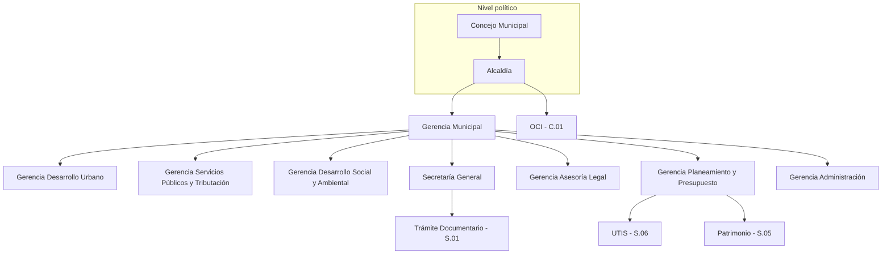

# Organigrama institucional

**Entidad:** Municipalidad Provincial de Acobamba  
**Versión:** 1.0  
**Fuente:** Organigrama oficial (documento institucional)  
**Uso en SGMI:** base para RBAC, derivación documentaria y filtros por unidad organizacional.

---

## Estructura jerárquica

### Nivel político y de dirección

| Código org | Unidad | Tipo | Proceso relacionado |
|------------|--------|------|---------------------|
| ORG-001 | Concejo Municipal | Político | E.01 |
| ORG-002 | Alcaldía | Ejecutivo | E.01 |
| ORG-003 | Gerencia Municipal | Ejecutivo | E.01 |
| ORG-004 | Mesa de Concertación | Comité | E.01 |
| ORG-005 | Consejo de Coordinación Local | Comité | E.01 |
| ORG-006 | Mancomunidad Qapaq Ñan | Comité | E.01 |
| ORG-007 | Municipalidades de Centros Poblados | Comité | E.01 |
| ORG-008 | Comité de Seguridad Alimentaria y Nutrición | Comité | E.01 |
| ORG-009 | Comité Provincial de Defensa Civil | Comité | E.01 / M.01 |
| ORG-010 | Comité de Seguridad Ciudadana | Comité | E.01 / M.02 |
| ORG-011 | Comité de Vigilancia del Presupuesto Participativo | Comité | E.01 / E.02 |
| ORG-012 | Junta de Delegados Vecinales y Comunales | Comité | E.01 |
| ORG-013 | Comité Ambiental Municipal | Comité | E.01 / M.03 |
| ORG-014 | Comité Municipal del Niño, Niña, Adolescente y la Mujer | Comité | E.01 / M.03 |

### Nivel gerencial y de control

| Código org | Unidad | Dependencia | Proceso |
|------------|--------|-------------|---------|
| ORG-015 | Oficina de Control Institucional (OCI) | Alcaldía / independiente | C.01 |
| ORG-016 | Gerencia de Desarrollo Urbano e Infraestructura | Gerencia Municipal | M.01 |
| ORG-017 | Gerencia de Servicios Públicos y Administración Tributaria | Gerencia Municipal | M.02 |
| ORG-018 | Gerencia de Desarrollo Social, Económico y Gestión Ambiental | Gerencia Municipal | M.03 |
| ORG-019 | Secretaría General | Gerencia Municipal | S.01 |
| ORG-020 | Gerencia de Asesoría Legal | Gerencia Municipal | E.03 |
| ORG-021 | Gerencia de Planeamiento y Presupuesto | Gerencia Municipal | E.02 |
| ORG-022 | Gerencia de Administración | Gerencia Municipal | Soporte |

---

## Detalle por gerencia

### Gerencia de Desarrollo Urbano e Infraestructura (ORG-016)

| Código org | Unidad | Proceso |
|------------|--------|---------|
| ORG-023 | Sub Gerencia de Acondicionamiento Territorial | M.01 |
| ORG-024 | Instituto Vial Provincial (ATMS) | M.01 |
| ORG-025 | Unidad de Estudios de Inversión | M.01 |
| ORG-026 | Unidad de Obras | M.01 |
| ORG-027 | Unidad de Supervisión y Liquidación de Obras | M.01 |
| ORG-028 | Área de Defensa Civil y GRD | M.01 |

### Gerencia de Servicios Públicos y Administración Tributaria (ORG-017)

| Código org | Unidad | Proceso |
|------------|--------|---------|
| ORG-029 | Unidad de Seguridad Ciudadana | M.02 |
| ORG-030 | Unidad de Transportes | M.02 |
| ORG-031 | Unidad de Limpieza Pública, Parques y Jardines | M.02 |
| ORG-032 | Unidad de Comercialización e Inocuidad Alimentaria | M.02 |
| ORG-033 | Matadero Municipal | M.02 |
| ORG-034 | Unidad de Administración Tributaria | M.02 |
| ORG-035 | Unidad de Fiscalización Tributaria | M.02 |
| ORG-036 | Unidad de Ejecución Coactiva | M.02 |
| ORG-037 | Unidad de Servicios al Ciudadano y Registro Civil | M.02 |

### Gerencia de Desarrollo Social, Económico y Gestión Ambiental (ORG-018)

| Código org | Unidad | Proceso |
|------------|--------|---------|
| ORG-038 | Sub Gerencia de Desarrollo Económico | M.03 |
| ORG-039 | Sub Gerencia de Desarrollo Social y Poblaciones Vulnerables | M.03 |
| ORG-040 | Unidad de Programas Sociales | M.03 |
| ORG-041 | DEMUNA | M.03 |
| ORG-042 | OMAPED | M.03 |
| ORG-043 | Unidad Local de Empadronamiento (ULE) | M.03 |
| ORG-044 | Centro Integral de Atención al Adulto Mayor (CIAM) | M.03 |
| ORG-045 | Unidad de la Mujer | M.03 |
| ORG-046 | Unidad de Gestión Ambiental | M.03 |
| ORG-047 | Unidad de Gestión de Servicios de Saneamiento Municipal | M.03 |

### Secretaría General (ORG-019)

| Código org | Unidad | Proceso | SGMI Fase 1 |
|------------|--------|---------|-------------|
| ORG-048 | Unidad de Trámite Documentario y Archivo | S.01 | **Operador principal MOD-DOC** |
| ORG-049 | Unidad de Imagen Institucional | S.01 | Consulta expedientes |

### Gerencia de Asesoría Legal (ORG-020)

| Código org | Unidad | Proceso | SGMI Fase 1 |
|------------|--------|---------|-------------|
| ORG-050 | Procuraduría Pública Municipal | E.03 | Destino derivación documentaria |

### Gerencia de Planeamiento y Presupuesto (ORG-021)

| Código org | Unidad | Proceso | SGMI Fase 1 |
|------------|--------|---------|-------------|
| ORG-051 | Unidad de Planeamiento y Racionalización | E.02 | Dashboard |
| ORG-052 | Unidad de Presupuesto | E.02 | INT-SIAF |
| ORG-053 | Unidad de Programación Multianual de Inversiones | E.02 | Futuro |
| ORG-054 | Unidad de Cooperación Técnica Nacional e Internacional | E.02 | Futuro |
| ORG-055 | Sub Gerencia de Gestión del Talento Humano | S.02 | INT-SIGA |
| ORG-056 | Unidad de Abastecimiento | S.03 | Futuro |
| ORG-057 | Unidad de Contabilidad | S.04 | INT-SIAF |
| ORG-058 | Unidad de Tesorería | S.04 | Futuro |
| ORG-059 | Unidad de Patrimonio | S.05 | INT-SIGA |
| ORG-060 | Unidad de Maquinarias y Equipos | S.05 | Futuro |
| ORG-061 | Unidad de Tecnología de la Información y Sistemas (UTIS) | S.06 | **Admin SGMI, MOD-PAT-TI** |

---

## Modelo de roles SGMI (derivado del organigrama)

| Rol sistema | Alcance típico | Unidades representativas |
|-------------|----------------|--------------------------|
| `ADMIN_SISTEMA` | Configuración global, usuarios, roles | UTIS (ORG-061) |
| `VISTA_EJECUTIVA` | Paneles generales y consultas (sin operación documentaria) | Alcaldía (ORG-002), Gerencia Municipal (ORG-003) |
| `GERENTE` | Dashboard de su gerencia, expedientes de su área | ORG-016 a ORG-022 |
| `PATRIMONIO` | Registro completo inventario municipal (dueño del dato) | Unidad Patrimonio (ORG-059) |
| `UTIS_SOPORTE` | Fichas técnicas/mantenimiento, incidencias, vista parcial inventario | UTIS (ORG-061) |
| `FINANZAS_SIAF` | Dashboard presupuestal SIAF (detalle limitado) | Presupuesto, Tesorería, Contabilidad |
| `SECRETARIA_GENERAL` | Tipos documentales, numeración por tipo/año | Secretaría General (ORG-019) |
| `SUPERVISOR_UNIDAD` | Bandeja y aprobaciones de su unidad | Sub gerencias, unidades |
| `OPERADOR` | Registro y consulta según permisos | Unidades operativas |
| `AUDITOR_OCI` | Solo lectura auditoría | OCI (ORG-015) |

> **Confirmado (PA-03):** un usuario tiene **una unidad activa**; traslados con historial. **PA-04:** comités ORG-004 a ORG-014 **sin flujo** documentario. **PA-05:** derivación por **gerencia real**.

---

## Diagrama simplificado (jerarquía gerencial)

---

## Sincronización con SIGA

Las unidades organizacionales (`ORG-xxx`) deben mapearse a códigos SIGA mediante **INT-SIGA** para:

1. Crear/actualizar estructura en SGMI sin digitación manual.
2. Asignar usuarios a unidades al importar personal.
3. Restringir derivación documentaria a unidades válidas del organigrama.
