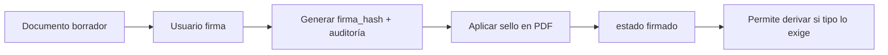

# ADR-004 — Firma digital y sello institucional

| Campo | Valor |
|-------|-------|
| **ADR** | ADR-004 |
| **Estado** | Aceptado |
| **Fecha** | 2026-06-10 |
| **Requisitos** | RF-DOC-12, RF-DOC-13, PA-08 |

---

## Contexto

Todos los documentos del expediente requieren **firma digital** y **sello institucional** antes o durante el flujo de tramitación (HU-DOC-08). En cada unidad que recepciona o remite, la firma y el sello sustituyen la constancia que antes se dejaba en la **hoja de cargo física** (PA-28; ver [digitalizacion-tramite-documentario.md](../../01_requisitos/digitalizacion-tramite-documentario.md)). No se especificó proveedor de certificados digitales Perú (IOFE, RENIEC, etc.) en Fase 1.

## Decisión

Implementar firma en **dos capas** con evolución a PKI:

### Capa 1 — Firma aplicativa (Fase 1 MVP)

| Elemento | Implementación |
|----------|----------------|
| Hash documento | SHA-256 del archivo PDF o contenido |
| Firma | `HMAC-SHA256(hash + usuario_id + timestamp + secret_app)` almacenado en `documento_firmas.firma_hash` |
| Identidad | Usuario autenticado SGMI + registro auditoría |
| Inmutabilidad | Tras firmar: documento `estado=firmado`; nuevo contenido = nueva versión |

Esto garantiza **trazabilidad y no repudio interno** vinculado a credenciales SGMI.

### Capa 2 — Sello institucional

| Elemento | Implementación |
|----------|----------------|
| Imagen sello | PNG institucional en `storage/sellos/sello_mpa.png` |
| Aplicación | Servicio `SelloService` superpone sello en PDF vía **FPDI** o **Dompdf** |
| Registro | `documento_sellos` con path del PDF sellado final |
| Visualización | PDF final con sello + metadata (código expediente, fecha) |

### Flujo

### Validación antes de derivar

Si `tipos_documentales.requiere_firma_antes_derivar = true` y documento principal no está `firmado` con sello → bloquear derivación.

## Evolución Fase 2 (no MVP)

- Integración certificado digital institucional (PKI).
- Campo `firma_metadata` JSON ya preparado para X.509 / timestamp authority.

## Alternativas evaluadas

| Alternativa | Decisión |
|-------------|----------|
| Solo proveído textual | Rechazada (PA-08) |
| PKI completo en MVP | Rechazada (sin proveedor confirmado) |
| **Firma aplicativa + sello visual** | **Aceptada MVP** |
| Firma dibujada en pantalla | Rechazada (baja seguridad) |

## Riesgos

| Riesgo | Mitigación |
|--------|------------|
| Firma no equivalente legal a PKI | Documentar alcance; plan Fase 2 PKI |
| Manipulación PDF | Hash + firma antes de sello; storage privado |

## Verificación

- [ ] Firmar bloquea edición sin nueva versión
- [ ] PDF final muestra sello
- [ ] Derivación rechazada sin firma cuando configurado
- [ ] Auditoría registra evento `firmar`
