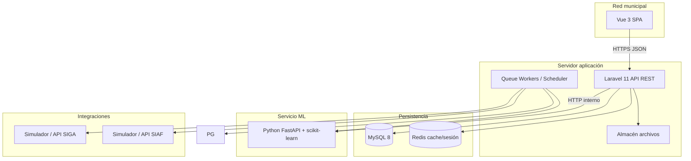
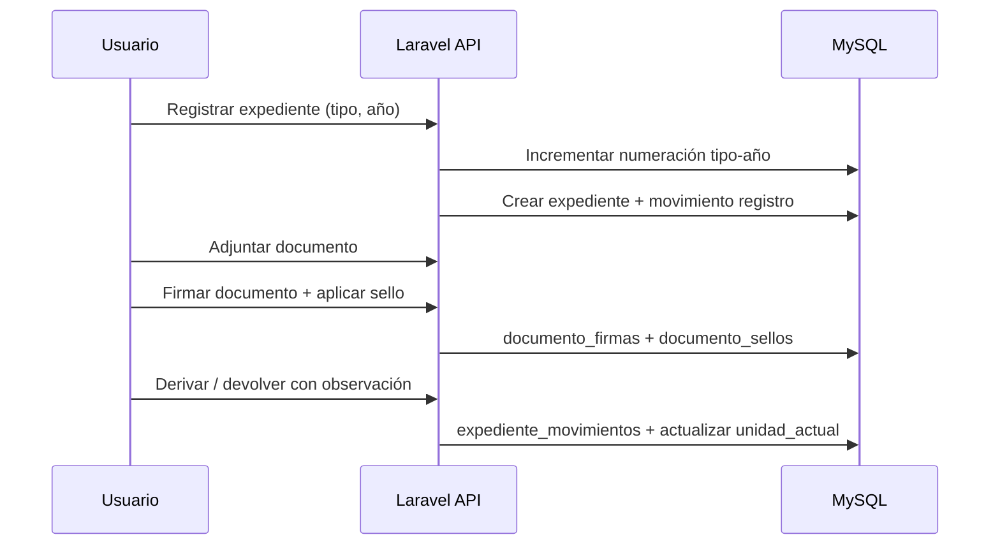
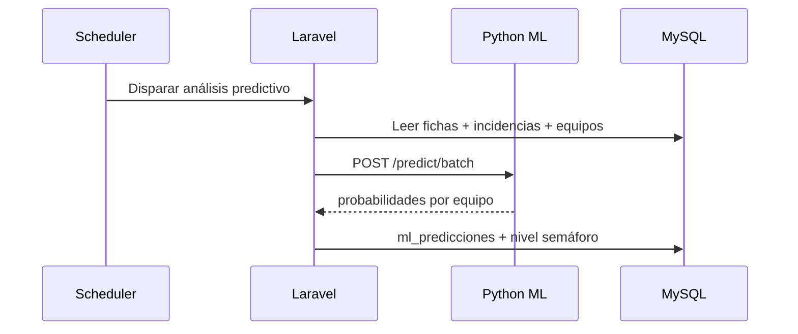
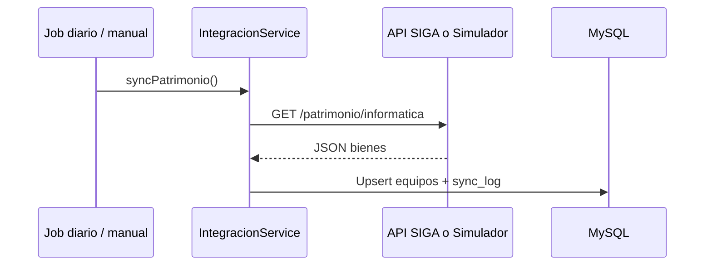

# Arquitectura del sistema — SGMI

**Versión:** 1.0  
**ADR relacionados:** ADR-001, ADR-002, ADR-003, ADR-004

---

## Vista de componentes



---

## Capas de la aplicación (Laravel)

| Capa | Responsabilidad | Ejemplo |
|------|-----------------|---------|
| **Controllers** | HTTP, validación request, respuesta JSON | `ExpedienteController` |
| **Form Requests** | Reglas de validación | `StoreExpedienteRequest` |
| **Services** | Lógica de negocio | `ExpedienteService`, `FirmaDigitalService` |
| **Repositories** | Acceso a datos | `ExpedienteRepository` |
| **Models** | Eloquent + relaciones | `Expediente`, `Equipo` |
| **Policies** | Autorización RBAC | `ExpedientePolicy` |
| **Jobs** | Sync SIGA/SIAF, ML batch | `SyncSigaPatrimonioJob` |
| **Events/Listeners** | Auditoría transversal | `AuditarAccion` |

---

## Módulos y paquetes lógicos

```
app/
├── Modules/
│   ├── Core/          # Auth, RBAC, auditoría, organigrama
│   ├── Documentaria/  # Expedientes, firmas, sellos
│   ├── Patrimonio/    # Equipos, fichas, incidencias
│   ├── Dashboard/     # Agregaciones y reportes
│   └── Integracion/   # SIGA, SIAF, simuladores
```

> Estructura modular dentro de monolito Laravel (ADR-001); no microservicios en Fase 1 excepto ML.

---

## Flujos principales

### Tramitación documentaria



### Predicción ML



### Sincronización SIGA



---

## Seguridad

| Aspecto | Implementación |
|---------|----------------|
| Autenticación | Laravel Sanctum (SPA cookie o token API) |
| Contraseñas | bcrypt/argon2, política 8+ especiales |
| Bloqueo | `bloqueado_hasta` + contador intentos |
| RBAC | Roles + Policies por módulo y unidad |
| Auditoría | Tabla append-only; sin UPDATE/DELETE app |
| Red | Restricción IP/middleware red municipal (RNF-13) |
| Archivos | Storage privado; URLs firmadas temporales |

---

## Despliegue objetivo (Fase 1)

| Componente | Entorno desarrollo (XAMPP) | Producción municipal |
|------------|---------------------------|----------------------|
| PHP | 8.2+ vía XAMPP | 8.2+ |
| BD | MySQL 8 / MariaDB (XAMPP) | MySQL 8.0+ |
| Frontend | Vite dev server / build estático | Nginx sirve `public/` |
| ML | Python 3.11 local | Servicio interno mismo servidor |
| Redis | Opcional dev; recomendado prod | Obligatorio |

Charset BD: `utf8mb4_unicode_ci` (ADR-001).

---

## Capacidad (PA-22)

- **200** usuarios registrados, **100** concurrentes
- Redis sesiones + índices en búsqueda expedientes
- Queue para sync y ML fuera del request crítico
- Test de carga objetivo: 100 sesiones en búsqueda < 2s (RNF-01)
