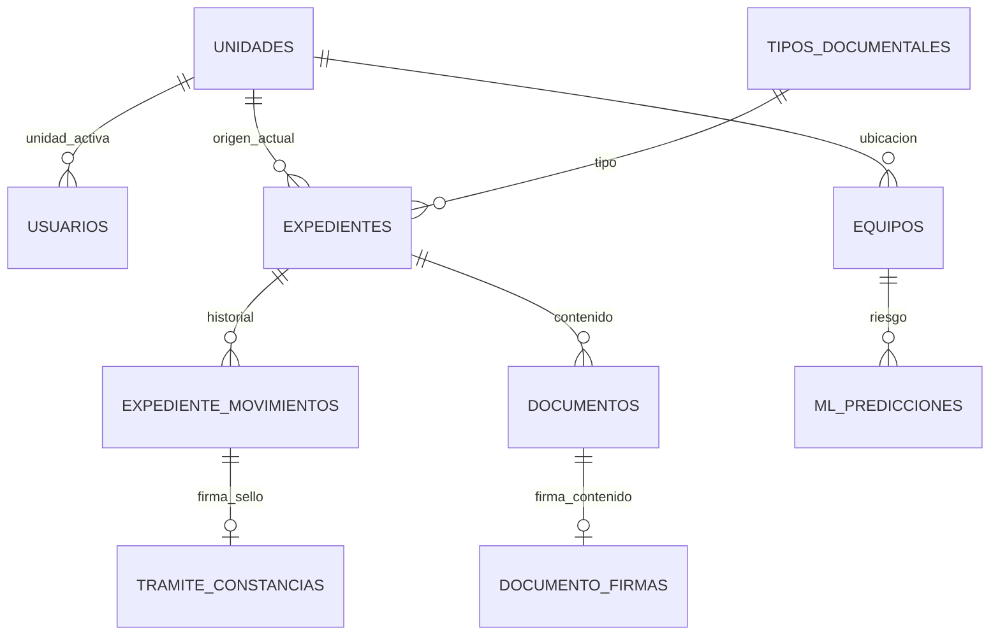

# Base de datos SGMI — Diseño integral Fase 1

**Versión:** 2.0  
**Motor:** MySQL 8.0+ / MariaDB 10.6+ (`utf8mb4_unicode_ci`)  
**Script ejecutable:** [schema-inicial.sql](./schema-inicial.sql)  
**Modelo detallado:** [modelo-datos.md](./modelo-datos.md)  
**Migración Laravel:** `database/migrations/2026_06_11_060000_create_sgmi_schema_tables.php`

---

## 1. Resumen por dominio

| Dominio | Módulo | Tablas | Registros típicos |
|---------|--------|--------|-------------------|
| Núcleo | NÚCLEO | 9 | Usuarios, roles, organigrama, auditoría |
| Documentaria | MOD-DOC | 12 | Expedientes, movimientos, firmas, sellos, tipos |
| Patrimonio TI | MOD-PAT-TI | 6 | Equipos, fichas, incidencias, ML |
| Integraciones | INT | 3 | Sync SIGA/SIAF, snapshots |
| **Total** | | **30 tablas** | + vistas lógicas |



---

## 2. NÚCLEO (9 tablas)

| Tabla | Función |
|-------|---------|
| `unidades_organizacionales` | Organigrama ORG-001…061; jerarquía; flag derivación |
| `usuarios` | Credenciales locales; una unidad activa |
| `roles` | ADMIN_SISTEMA, OPERADOR, SECRETARIA_GENERAL, … |
| `permisos` | Granular por módulo (`doc.derivar`, `pat.registrar`, …) |
| `role_permiso` | RBAC |
| `usuario_role` | Usuario ↔ roles |
| `usuario_traslados` | Historial rotación entre unidades (PA-03) |
| `auditoria_logs` | Append-only; RF-NC-05 |

**Claves de negocio:** `codigo_org` único; comités sin `permite_derivacion`.

---

## 3. MOD-DOC (12 tablas)

### Catálogo y numeración

| Tabla | Función |
|-------|---------|
| `tipos_documentales` | Catálogo normas + gestión interna; unidad emisora (PA-29) |
| `tipo_documental_unidades_registro` | Sub-unidades autorizadas a registrar un tipo |
| `numeraciones_expediente` | Secuencia **por tipo + año** (PA-09) |

### Expediente y trámite

| Tabla | Función |
|-------|---------|
| `expedientes` | Cabecera; código; unidad origen/actual; estados bandeja |
| `expediente_movimientos` | Historial: registro, recepción, derivación, devolución |
| `tramite_constancias` | Firma + sello **por movimiento** (sustituto cargo PA-28) |
| `documentos` | PDF/contenido versionado del expediente |
| `documento_firmas` | Firma del **contenido** documental |
| `documento_sellos` | Sello visual sobre PDF del documento |
| `expediente_adjuntos` | Anexos adicionales |
| `sellos_institucionales` | Imagen de sello por unidad o municipal |

### Estados del expediente (`expedientes.estado`)

| Estado | Bandeja | Descripción |
|--------|---------|-------------|
| `registrado` | Origen | Creado; aún no circula o recién creado |
| `por_recepcionar` | Destino | Derivado a unidad; falta acuse digital |
| `en_tramite` | Unidad actual | Recepcionado; puede derivar/devolver/firmar |
| `devuelto` | Remitente | Devolución automática (PA-27) |
| `archivado` | — | Trámite cerrado |

### Movimientos (`tipo_movimiento`)

| Tipo | Cuándo |
|------|--------|
| `registro` | Alta del expediente |
| `recepcion` | Acuse en unidad destino (PA-28) |
| `derivacion` | Remisión a otra unidad (PA-26) |
| `devolucion` | Retorno al remitente inmediato (PA-27) |

Cada `recepcion`, `derivacion` y `devolucion` puede tener una fila en `tramite_constancias`.

---

## 4. MOD-PAT-TI (6 tablas)

| Tabla | Función |
|-------|---------|
| `equipos` | Inventario municipal TI (Patrimonio dueño) |
| `fichas_tecnicas` | 1:1 con equipo; UTIS mantiene |
| `fichas_mantenimiento` | Historial preventivo/correctivo |
| `incidencias` | Fallas y requerimientos TI |
| `ml_modelos` | Versiones Random Forest |
| `ml_predicciones` | Semáforo verde/amarillo/rojo |

---

## 5. INT (3 tablas)

| Tabla | Función |
|-------|---------|
| `sync_logs` | Cabecera sync SIGA/SIAF |
| `sync_log_detalles` | Detalle por registro importado |
| `siaf_ejecucion_snapshots` | Lectura presupuestal limitada (PA-18) |

---

## 6. Vistas (consultas dashboard)

Definidas al final de `schema-inicial.sql`:

| Vista | Uso |
|-------|-----|
| `v_bandeja_pendientes` | Expedientes por unidad + tipo + prioridad |
| `v_expediente_timeline` | Movimientos + constancias para trazabilidad |
| `v_dashboard_tramitacion` | Conteos por unidad y estado |
| `v_equipos_riesgo` | Última predicción ML por equipo |
| `v_equipos_utis` | Columnas visibles para rol UTIS |

MOD-DASH **no requiere tablas propias** en Fase 1; agrega sobre estas vistas.

---

## 7. Índices críticos

| Tabla | Índice | Consulta |
|-------|--------|----------|
| `expedientes` | `(unidad_actual_id, estado)` | Bandeja |
| `expedientes` | `codigo` | Búsqueda RF-DOC-10 |
| `expedientes` | FULLTEXT `asunto` | Búsqueda texto |
| `expediente_movimientos` | `(expediente_id, created_at)` | Timeline |
| `numeraciones_expediente` | UNIQUE `(tipo_documental_id, anio)` | Numeración segura |
| `ml_predicciones` | `(equipo_id, calculado_at)` | Último riesgo |

---

## 8. Reglas de integridad (aplicación + DB)

1. **Numeración:** `SELECT … FOR UPDATE` en `numeraciones_expediente` dentro de transacción.
2. **Devolución:** CHECK — observación obligatoria si `tipo_movimiento = devolucion`.
3. **Recepción:** solo si `unidad_actual` = unidad del usuario y estado `por_recepcionar`.
4. **Derivar:** bloqueado si `por_recepcionar`; firma requerida según tipo documental.
5. **Registro tipo:** `unidad_origen` debe coincidir con emisora o estar en `tipo_documental_unidades_registro`.
6. **Auditoría:** sin UPDATE/DELETE en `auditoria_logs` desde app.

---

## 9. Orden de despliegue

```bash
# 1. Migración Laravel
php artisan migrate

# 2. O script directo MySQL
mysql -u root sgmi_mpa < docs/02_diseno/schema-inicial.sql

# 3. Seed
php artisan db:seed --class=SgmiSeeder
```

---

## 10. Trazabilidad requisitos → tablas

| Requisito / PA | Tablas |
|----------------|--------|
| PA-03 traslados | `usuario_traslados`, `usuarios` |
| PA-09 numeración | `numeraciones_expediente`, `expedientes` |
| PA-24 multietapa | `expediente_movimientos`, `expedientes` |
| PA-27 devolución | `expediente_movimientos` |
| PA-28 sin cargo | `tramite_constancias`, `expediente_movimientos` |
| PA-29 tipos por área | `tipos_documentales`, `tipo_documental_unidades_registro` |
| PA-08 firma/sello | `documento_firmas`, `documento_sellos`, `tramite_constancias` |
| RF-PAT-08 ML | `ml_predicciones`, `ml_modelos` |
| RI-SIGA | `sync_logs`, `equipos`, `unidades_organizacionales` |
| RI-SIAF | `siaf_ejecucion_snapshots` |
