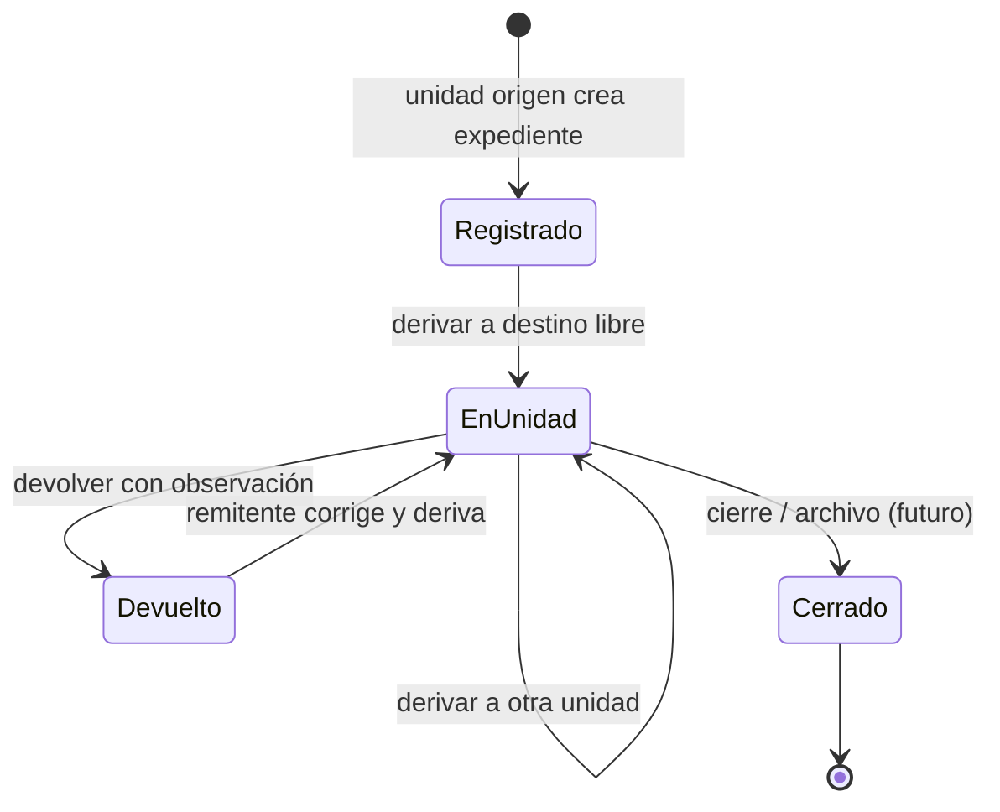
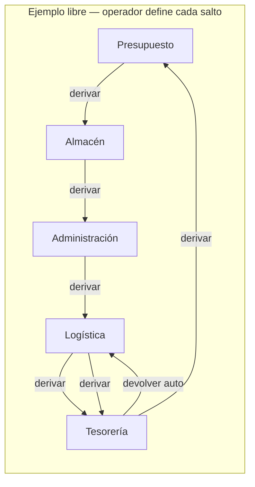

# Flujo documentario multietapa entre unidades

**Versión:** 1.0  
**Fecha:** 2026-06-11  
**Estado:** Confirmado (PA-23 … PA-27)  
**Módulo:** MOD-DOC (S.01)  
**Relacionado:** [decisiones-confirmadas.md](../01_requisitos/decisiones-confirmadas.md), [arquitectura-interfaz-y-modulos.md](../01_requisitos/arquitectura-interfaz-y-modulos.md), [organigrama-institucional.md](../01_requisitos/organigrama-institucional.md)

---

## 1. Contexto

En la Municipalidad Provincial de Acobamba, cada **unidad organizacional** produce y tramita **su documentación** (Presupuesto, Patrimonio, Logística, Almacén/Abastecimiento, Administración, Tesorería, Contabilidad, Secretaría General, UTIS, etc.). Un mismo expediente **circula** entre unidades hasta completar el trámite; no se duplica por área.

Ejemplos de cadena (ilustrativos, no obligatorios):

| Caso | Recorrido posible |
|------|-------------------|
| Abastecimiento / compras | Presupuesto → Almacén → Administración → Logística → Tesorería → … |
| Patrimonio | Patrimonio → Logística → Almacén → … |
| Retorno al origen | Tras varias derivaciones, el expediente puede volver a la **unidad que lo inició** (ej. Presupuesto) |

El SGMI registra **un expediente** con **historial completo** de movimientos.

### Sustitución del cargo físico (PA-28)

Antes, el seguimiento interno dependía de una **hoja de cargo** adjunta al expediente en papel. En SGMI esa función se **digitaliza**: el código `EXP-{año}-{secuencia}`, los movimientos registrados, la firma y el sello por unidad, y la pantalla de trazabilidad reemplazan el cargo como mecanismo principal de seguimiento. No existe entidad “Cargo” en el modelo de datos.

Documento de negocio: [digitalizacion-tramite-documentario.md](../01_requisitos/digitalizacion-tramite-documentario.md).

---

## 2. Principios del flujo

| Principio | Descripción |
|-----------|-------------|
| Un expediente, muchas unidades | Un código (`EXP-{año}-{secuencia}`) y una línea de tiempo |
| Unidad actual | Solo la unidad que **tiene** el expediente lo ve en **bandeja de pendientes** |
| Derivación libre | El operador elige **cualquier unidad válida** del organigrama como destino |
| Sin rutas fijas | No hay plantillas obligatorias por tipo documental en Fase 1 |
| Devolución para corrección | Estado operativo principal ante errores: **devuelto** |
| Sin “rechazado” habitual | La entidad **no usa** rechazo formal en la práctica (Fase 1) |
| Retorno automático | Al devolver, el sistema envía el expediente a la **unidad remitente inmediata** (sin elegir destino) |
| Observación obligatoria | Toda devolución exige texto de observación |
| Trazabilidad | Cada derivación y devolución queda en historial (usuario, fecha, unidades, observación) |
| Sin cargo físico | Seguimiento vía expediente + historial; constancia = movimiento firmado y sellado (PA-28) |

---

## 3. Acciones del sistema

### 3.1 Derivar (remitir)

**Quién:** usuario de la unidad que tiene el expediente en bandeja.  
**Qué hace:** envía el expediente a otra unidad del organigrama.  
**UI:** selector de **unidad destino** (lista de unidades activas).  
**Opcional:** proveído u observación en la derivación (según HU-DOC-02).  
**Resultado:**

- `unidad_actual` = destino elegido
- Historial: movimiento tipo `derivacion` con origen, destino, usuario, timestamp, observación/proveído

### 3.2 Devolver

**Quién:** usuario de la unidad que **recibió** el expediente por derivación.  
**Qué hace:** devuelve para corrección.  
**UI:** solo campo de **observación** (obligatorio); **sin** selector de destino.  
**Lógica automática:**

```
unidad_destino_devolucion = unidad_origen del último movimiento tipo derivacion hacia unidad_actual
```

Es decir: un paso atrás en la cadena (quien lo derivó a la unidad actual).

**Resultado:**

- `unidad_actual` = unidad remitente inmediata
- Estado visible: **devuelto** (o equivalente en bandeja del remitente)
- Historial: movimiento tipo `devolucion` con observación obligatoria

**Ejemplos:**

| Situación | Devolución automática |
|-----------|------------------------|
| Presupuesto derivó a Almacén; Almacén devuelve | → Presupuesto |
| Administración derivó a Logística; Logística devuelve | → Administración |
| Presupuesto → Almacén → Administración; Administración devuelve | → quien derivó a Administración (según último movimiento) |

### 3.3 Recepcionar (acuse digital)

**Quién:** usuario de la unidad que recibió el expediente por derivación.  
**Qué hace:** confirma que la unidad **tomó** el trámite en su bandeja (equivalente al acuse en hoja de cargo).  
**UI:** acción **Recepcionar y sellar** (firma + sello institucional con unidad y fecha).  
**Resultado:**

- Movimiento tipo `recepcion` con firma y sello vinculados
- Expediente pasa de **pendiente de recepción** a **en trámite en mi unidad**
- Requisito previo para derivar o devolver desde esa unidad (PA-28)

### 3.4 Firmar y sellar (salida / proveído)

**Quién:** usuario autorizado de la unidad actual.  
**Qué hace:** firma digital + sello sobre el PDF (nueva versión) antes o al **derivar**.  
**Relacionado:** ADR-004, HU-DOC-08; obligatorio cuando `requiere_firma_antes_derivar` del tipo documental.

### 3.5 Rechazar

**Fase 1:** **no implementar** en UI ni API (decisión PA-25). La entidad corrige vía **devolución**.

---

## 4. Estados del expediente (vista operativa)

| Estado / situación | Significado |
|--------------------|-------------|
| Registrado | Creado en unidad origen (`unidad_origen`) |
| Por recepcionar | En bandeja de unidad X pero sin acuse digital (PA-28) |
| En unidad X / En trámite | Recepcionado en bandeja de unidad X (`unidad_actual`) |
| Devuelto | Regresó por devolución; visible en bandeja del remitente para corrección |
| Firmado / Proveído | Paso validado (firma digital + sello cuando aplique) |
| Cerrado / Archivado | Trámite finalizado (reglas de cierre a detallar con Secretaría General) |

No se define estado **rechazado** en Fase 1.

---

## 5. Diagrama de flujo





---

## 6. Modelo de datos (referencia)

Alineado con `expediente_movimientos` en [modelo-datos.md](./modelo-datos.md):

| Campo movimiento | Uso |
|------------------|-----|
| `tipo` | `derivacion`, `devolucion`, `registro`, `firma`, … |
| `unidad_origen_id` | Quien envía |
| `unidad_destino_id` | Quien recibe |
| `usuario_id` | Operador |
| `observacion` | Obligatoria en devolución |
| `proveido` | Opcional en derivación |
| `created_at` | Trazabilidad temporal |

**Expediente:**

- `unidad_origen_id` — quien creó el trámite
- `unidad_actual_id` — quien tiene la bandeja ahora
- Para devolución automática: consultar último movimiento `derivacion` donde `unidad_destino_id = unidad_actual`

---

## 7. Reglas de negocio (implementación)

1. Solo usuarios con permiso `doc.derivar` pueden derivar desde su unidad activa cuando el expediente está en su unidad actual.
2. Solo usuarios con permiso `doc.devolver` pueden devolver cuando el expediente está en su unidad actual.
3. Destino de derivación debe ser unidad **activa** del organigrama (PA-05).
4. Devolución sin observación → error de validación.
5. Devolución sin movimiento previo de derivación hacia la unidad actual → error (no se puede devolver lo que no fue derivado).
6. No validar “ruta esperada” por tipo documental en Fase 1.
7. Alcaldía / Gerencia Municipal: sin bandeja operativa masiva (PA-06, vista ejecutiva).

---

## 8. Interfaz (resumen)

- **Una aplicación SGMI**; bandeja filtrada por `unidad_actual` del expediente.
- Módulo **Gestión Documental** compartido; menú según rol (ver [arquitectura-interfaz-y-modulos.md](../01_requisitos/arquitectura-interfaz-y-modulos.md)).
- Pantallas ya prototipadas: bandeja, registro, trazabilidad.

---

## 9. Trazabilidad a requisitos

| Decisión | RF / HU |
|----------|---------|
| Derivación libre | RF-DOC-03, HU-DOC-02 |
| Devolución + observación | RF-DOC-05, HU-DOC-02 |
| Historial | RF-DOC-06, HU-DOC-03 |
| Bandeja por unidad | RF-DOC-07, HU-DOC-04 |
| Sin SLA | PA-11, RF-DASH-01 |

---

## 10. Pendientes de aclaración (futuro)

| Tema | Nota |
|------|------|
| Cierre / archivo | ¿Solo Secretaría General o cualquier unidad origen? |
| Devolución al origen vs un paso | Confirmado: **un paso atrás** (remitente inmediato) |
| Rutas sugeridas por tipo | Could have Fase 2; no Fase 1 |
| Estado “rechazado” | Reservado; no usar en Fase 1 |
| PDF constancia tipo cargo | Opcional Fase 2; generado desde historial (PA-28) |
