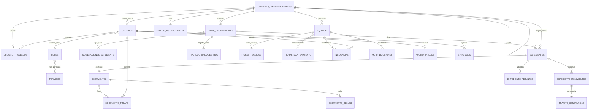

# Modelo de datos — SGMI Fase 1

**Versión:** 2.0  
**Motor:** MySQL 8.0+ (MariaDB 10.6+ compatible, utf8mb4)  
**Script:** [schema-inicial.sql](./schema-inicial.sql)  
**Guía integral:** [base-datos-sgmi.md](./base-datos-sgmi.md)  
**Prompt:** D-001

---

## Diagrama entidad-relación

---

## Dominio 1 — Núcleo y organigrama

### `unidades_organizacionales`

| Columna | Tipo | Descripción |
|---------|------|-------------|
| id | BIGINT UNSIGNED PK | |
| codigo_org | VARCHAR(20) UNIQUE | ORG-001 … ORG-061 |
| codigo_siga | VARCHAR(50) NULL | Mapeo SIGA |
| nombre | VARCHAR(200) | |
| tipo | ENUM | `politico`, `ejecutivo`, `gerencia`, `unidad`, `comite` |
| permite_derivacion | BOOLEAN | `false` para comités (PA-04) |
| gerencia_id | FK self NULL | Gerencia real (PA-05) |
| padre_id | FK self NULL | Jerarquía |
| activa | BOOLEAN | |
| timestamps | | |

**Reglas:** Solo `gerencia` y `unidad` con `permite_derivacion=true` son destino de tramitación.

### `usuarios`

| Columna | Tipo | Descripción |
|---------|------|-------------|
| id | BIGINT UNSIGNED PK | |
| username | VARCHAR(50) UNIQUE | |
| email | VARCHAR(100) NULL | |
| password | VARCHAR | Hash bcrypt |
| nombre_completo | VARCHAR(200) | |
| unidad_activa_id | FK unidades | Una sola unidad (PA-03) |
| activo | BOOLEAN | |
| intentos_fallidos | SMALLINT DEFAULT 0 | |
| bloqueado_hasta | TIMESTAMP NULL | 5 min tras 5 intentos |
| ultimo_login | TIMESTAMP NULL | |
| timestamps | | |

### `usuario_traslados`

Historial de rotación/traslado (PA-03).

| Columna | Tipo |
|---------|------|
| id | BIGINT UNSIGNED PK |
| usuario_id | FK |
| unidad_id | FK |
| fecha_inicio | DATE |
| fecha_fin | DATE NULL |
| motivo | TEXT NULL |
| registrado_por | FK usuarios |

### `roles`, `permisos`, `role_permiso`, `usuario_role`

Roles confirmados: `ADMIN_SISTEMA`, `VISTA_EJECUTIVA`, `GERENTE`, `PATRIMONIO`, `UTIS_SOPORTE`, `FINANZAS_SIAF`, `SECRETARIA_GENERAL`, `SUPERVISOR_UNIDAD`, `OPERADOR`, `AUDITOR_OCI`.

### `auditoria_logs`

Append-only (RNF-07). Sin UPDATE/DELETE desde aplicación.

| Columna | Tipo |
|---------|------|
| id | BIGINT UNSIGNED PK |
| usuario_id | FK NULL |
| modulo | VARCHAR(50) |
| accion | VARCHAR(50) |
| entidad | VARCHAR(50) |
| entidad_id | BIGINT NULL |
| ip_address | VARCHAR(45) |
| metadata | JSON |
| created_at | TIMESTAMP |

---

## Dominio 2 — Gestión documentaria

### `tipos_documentales`

Catálogo institucional (PA-07, PA-29). Administrado por Secretaría General. Listado inicial de normas legales: [catalogo-tipos-normas-documentales.md](../01_requisitos/catalogo-tipos-normas-documentales.md).

| Columna | Tipo | Descripción |
|---------|------|-------------|
| id | BIGINT UNSIGNED PK | |
| codigo | VARCHAR(20) UNIQUE | Código interno (ej. RAL, DAL, RGPPM) |
| nombre | VARCHAR(150) | Nombre institucional |
| prefijo_numeracion | VARCHAR(20) | Ej. RAL, ACM, RGDES |
| formato_display | VARCHAR(50) | Ej. `{prefijo}-{anio}-{secuencial}` |
| clase_norma | ENUM | `acuerdo`, `decreto`, `ordenanza`, `resolucion`, `directiva`, `otro` |
| ambito_emision | ENUM | `concejo`, `alcaldia`, `gerencia_municipal`, `gerencia`, `sub_gerencia`, `unidad` |
| unidad_emisora_id | FK nullable | Unidad que gestiona y registra el tipo (PA-29) |
| registro_por_secretaria | BOOLEAN DEFAULT false | Secretaría General puede registrar en nombre de emisor |
| requiere_firma_antes_derivar | BOOLEAN DEFAULT true | |
| activo | BOOLEAN | |

| requiere_recepcion | BOOLEAN DEFAULT true | Acuse digital al derivar (PA-28) |

**Regla registro:** selector de tipo filtra por `unidad_emisora_id` = unidad activa del usuario (o hijas en `tipo_documental_unidades_registro`), o `registro_por_secretaria` + rol Secretaría General.

### `tipo_documental_unidades_registro` (PA-29)

Sub-unidades autorizadas a registrar un tipo además de la unidad emisora.

| Columna | Tipo |
|---------|------|
| tipo_documental_id | FK PK |
| unidad_id | FK PK |

### `sellos_institucionales`

Imagen de sello municipal (`unidad_id` NULL) o por unidad.

### `numeraciones_expediente`

Secuencia **por tipo + año** (PA-09). No código global único.

| Columna | Tipo |
|---------|------|
| id | BIGINT UNSIGNED PK |
| tipo_documental_id | FK UNIQUE(tipo, anio) |
| anio | SMALLINT |
| ultimo_secuencial | INTEGER DEFAULT 0 |

**Índice único:** `(tipo_documental_id, anio)`

### `expedientes`

| Columna | Tipo | Descripción |
|---------|------|-------------|
| id | BIGINT UNSIGNED PK | |
| tipo_documental_id | FK | |
| anio | SMALLINT | |
| secuencial | INTEGER | |
| codigo | VARCHAR(50) | Generado: prefijo-año-secuencial |
| asunto | VARCHAR(500) | |
| prioridad | ENUM | `baja`, `media`, `alta`, `urgente` |
| unidad_origen_id | FK | |
| unidad_actual_id | FK | Bandeja actual |
| estado | ENUM | `registrado`, `por_recepcionar`, `en_tramite`, `devuelto`, `archivado` |
| documento_principal_id | FK documentos NULL | PDF principal vigente |
| registrado_por | FK usuarios | |
| archivado_por | FK NULL | |
| archivado_at | TIMESTAMP NULL | |
| timestamps | | |

**Índice único:** `(tipo_documental_id, anio, secuencial)`  
**Índices búsqueda:** `codigo`, `asunto` (FULLTEXT MySQL), `unidad_actual_id`

### `documentos`

Un expediente puede tener uno o más documentos (versiones).

| Columna | Tipo |
|---------|------|
| id | BIGINT UNSIGNED PK |
| expediente_id | FK |
| version | SMALLINT DEFAULT 1 |
| titulo | VARCHAR(300) |
| archivo_path | VARCHAR(500) NULL |
| hash_contenido | VARCHAR(64) | SHA-256 para firma |
| es_principal | BOOLEAN | Documento principal del expediente |
| documento_anterior_id | FK self NULL | Cadena de versiones |
| estado | ENUM | `borrador`, `pendiente_firma`, `firmado` |
| creado_por | FK |

### `documento_firmas` (PA-08)

Firma del **contenido** del documento (PDF).

| Columna | Tipo |
|---------|------|
| id | BIGINT UNSIGNED PK |
| documento_id | FK UNIQUE |
| usuario_id | FK firmante |
| unidad_id | FK | Unidad al firmar |
| firma_hash | VARCHAR(128) |
| firma_metadata | JSON |
| firmado_at | TIMESTAMP |

### `documento_sellos` (PA-08)

| Columna | Tipo |
|---------|------|
| id | BIGINT UNSIGNED PK |
| documento_id | FK UNIQUE |
| sello_institucional_id | FK NULL |
| sello_imagen_path | VARCHAR(500) |
| sello_metadata | JSON |
| aplicado_at | TIMESTAMP |

### `expediente_movimientos`

| Columna | Tipo |
|---------|------|
| id | BIGINT UNSIGNED PK |
| expediente_id | FK |
| tipo_movimiento | ENUM | `registro`, `recepcion`, `derivacion`, `devolucion` |
| unidad_origen_id | FK NULL |
| unidad_destino_id | FK NULL |
| unidad_actuante_id | FK | Unidad que ejecuta el acto |
| usuario_id | FK |
| observacion | TEXT | Obligatoria en devolución |
| proveido | TEXT NULL |
| created_at | TIMESTAMP |

### `tramite_constancias` (PA-28)

Sustituto digital del cargo: firma + sello por movimiento de trámite.

| Columna | Tipo |
|---------|------|
| id | BIGINT UNSIGNED PK |
| expediente_movimiento_id | FK UNIQUE |
| documento_id | FK NULL | PDF tras sello si aplica |
| usuario_id | FK |
| unidad_id | FK |
| tipo_acto | ENUM | `recepcion`, `proveido_salida`, `devolucion`, `firma_documento` |
| firma_hash | VARCHAR(128) |
| sello_institucional_id | FK NULL |
| sello_imagen_path | VARCHAR(500) NULL |
| sello_texto | VARCHAR(500) NULL |
| pdf_resultante_path | VARCHAR(500) NULL |
| sello_metadata | JSON |
| created_at | TIMESTAMP |

**Bandeja:** `v_bandeja_pendientes` o expedientes donde `unidad_actual_id` = unidad del usuario.

### `expediente_adjuntos`

| Columna | Tipo |
|---------|------|
| id | BIGINT UNSIGNED PK |
| expediente_id | FK |
| nombre_archivo | VARCHAR(255) |
| path | VARCHAR(500) |
| mime_type | VARCHAR(100) |
| tamano_bytes | BIGINT |
| subido_por | FK |
| created_at | TIMESTAMP |

---

## Dominio 3 — Patrimonio y TI

### `equipos`

**Dueño del dato:** Patrimonio (PA-15). Solo equipos municipales (PA-13).

| Columna | Tipo | Visibilidad UTIS |
|---------|------|------------------|
| id | BIGINT UNSIGNED PK | — |
| codigo_patrimonial | VARCHAR(50) UNIQUE NULL | Sí |
| codigo_siga | VARCHAR(50) NULL | No |
| tipo_equipo | ENUM | Sí | `pc`, `servidor`, `impresora`, `red`, `otro` |
| marca | VARCHAR(100) | Sí |
| modelo | VARCHAR(100) | Sí |
| numero_serie | VARCHAR(100) | Sí |
| estado_operativo | ENUM | Sí | `operativo`, `reparacion`, `baja`, `almacen` |
| unidad_id | FK | Sí |
| custodio_nombre | VARCHAR(200) | Sí | Jefe área (PA-14) |
| custodio_cargo | VARCHAR(150) | Sí |
| valor_patrimonial | DECIMAL(12,2) NULL | **No** (solo Patrimonio) |
| fecha_adquisicion | DATE NULL | Parcial |
| registrado_por | FK | — |
| timestamps | | |

### `fichas_tecnicas` (UTIS — PA-15)

| Columna | Tipo |
|---------|------|
| id | BIGINT UNSIGNED PK |
| equipo_id | FK UNIQUE |
| cpu | VARCHAR(100) |
| ram_gb | SMALLINT |
| almacenamiento_gb | INTEGER |
| sistema_operativo | VARCHAR(100) |
| red | VARCHAR(100) NULL |
| antiguedad_anios | DECIMAL(4,1) |
| componentes_json | JSON |
| registrado_por | FK |
| timestamps | |

### `fichas_mantenimiento`

| Columna | Tipo |
|---------|------|
| id | BIGINT UNSIGNED PK |
| equipo_id | FK |
| tipo | ENUM | `preventivo`, `correctivo` |
| fecha | DATE |
| descripcion | TEXT |
| resultado | TEXT NULL |
| tecnico | VARCHAR(150) |
| registrado_por | FK |
| created_at | TIMESTAMP |

### `incidencias`

| Columna | Tipo |
|---------|------|
| id | BIGINT UNSIGNED PK |
| equipo_id | FK |
| reportado_por | FK |
| tipo | ENUM | `falla`, `averia`, `requerimiento` |
| descripcion | TEXT |
| estado | ENUM | `abierta`, `en_atencion`, `cerrada` |
| solucion | TEXT NULL |
| asignado_utis_id | FK NULL |
| created_at | TIMESTAMP |
| cerrada_at | TIMESTAMP NULL |

### `ml_modelos`

| Columna | Tipo |
|---------|------|
| id | BIGINT UNSIGNED PK |
| version | VARCHAR(20) |
| algoritmo | VARCHAR(50) | `random_forest` |
| parametros_json | JSON |
| metricas_json | JSON |
| modelo_path | VARCHAR(500) NULL |
| entrenado_at | TIMESTAMP |

### `ml_predicciones` (PA-12)

| Columna | Tipo |
|---------|------|
| id | BIGINT UNSIGNED PK |
| equipo_id | FK |
| ml_modelo_id | FK |
| probabilidad_falla | DECIMAL(5,4) | 0–1 |
| nivel_riesgo | ENUM | `verde`, `amarillo`, `rojo` |
| factores_json | JSON | Variables usadas |
| calculado_at | TIMESTAMP |

**Índice:** `(equipo_id, calculado_at DESC)` para última predicción.

---

## Dominio 4 — Integraciones y dashboard

### `sync_logs`

| Columna | Tipo |
|---------|------|
| id | BIGINT UNSIGNED PK |
| sistema | ENUM | `siga`, `siaf` |
| tipo_sync | VARCHAR(50) | `patrimonio`, `organigrama`, `presupuesto` |
| modo | ENUM | `automatico`, `manual` |
| estado | ENUM | `ok`, `parcial`, `error` |
| registros_ok | INTEGER |
| registros_error | INTEGER |
| mensaje | TEXT NULL |
| ejecutado_por | FK NULL |
| ejecutado_at | TIMESTAMP |

### `sync_log_detalles`

Detalle por registro importado en una sincronización.

| Columna | Tipo |
|---------|------|
| id | BIGINT UNSIGNED PK |
| sync_log_id | FK |
| entidad_externa | VARCHAR(50) |
| referencia | VARCHAR(100) NULL |
| entidad_local | VARCHAR(50) NULL |
| entidad_local_id | BIGINT NULL |
| estado | ENUM | `ok`, `error`, `omitido` |
| mensaje | TEXT NULL |

### `siaf_ejecucion_snapshots` (PA-18)

Detalle limitado; acceso solo FINANZAS_SIAF.

| Columna | Tipo |
|---------|------|
| id | BIGINT UNSIGNED PK |
| periodo | VARCHAR(20) | Ej. 2026-06 |
| pim | DECIMAL(14,2) |
| ejecucion_total | DECIMAL(14,2) |
| porcentaje_ejecucion | DECIMAL(5,2) |
| detalle_resumido_json | JSON | Metas agregadas, sin proveedores |
| sincronizado_at | TIMESTAMP |
| es_simulacion | BOOLEAN DEFAULT false |

---

## Vistas lógicas (no tablas)

| Vista / query | Uso |
|---------------|-----|
| `v_bandeja_pendientes` | Expedientes en `unidad_actual` + filtros usuario |
| `v_dashboard_tramitacion` | Tiempos entre movimientos por unidad (sin SLA) |
| `v_equipos_riesgo` | Última `ml_predicciones` + equipo |
| `v_equipos_utis` | Subset columnas para rol UTIS |

---

## Reglas de integridad

1. **Numeración:** transacción con `SELECT ... FOR UPDATE` en `numeraciones_expediente`.
2. **Firma:** no derivar si `requiere_firma_antes_derivar` y documento no `firmado`.
3. **Devolución:** `tipo_movimiento=devolucion` exige `observacion` no vacía; destino = unidad del movimiento anterior.
4. **Traslado usuario:** al cambiar `unidad_activa_id`, cerrar traslado anterior y abrir nuevo en `usuario_traslados`.
5. **Auditoría:** triggers o eventos Laravel; revocar UPDATE/DELETE en `auditoria_logs` vía permisos DB.

---

## Trazabilidad RF → tabla

| RF | Tabla(s) principal(es) |
|----|------------------------|
| RF-DOC-01 | `numeraciones_expediente`, `expedientes` |
| RF-DOC-12/13 | `documento_firmas`, `documento_sellos` |
| RF-NC-09 | `usuario_traslados`, `usuarios` |
| RF-PAT-08 | `ml_predicciones`, `ml_modelos` |
| RI-SIGA-* | `equipos`, `unidades`, `sync_logs` |
| RI-SIAF-* | `siaf_ejecucion_snapshots`, `sync_logs` |
